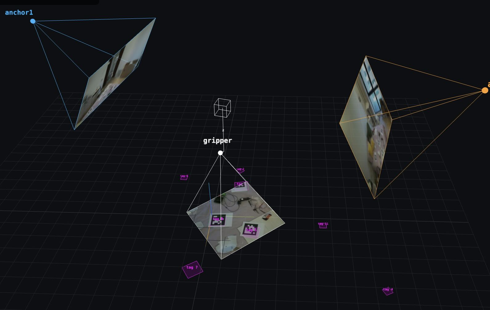

# Stringman experiments

Experiments with [Stringman from Newfangled robotics](https://neufangled.com/)
for camera calibration, AprilTag detection, and extrinsic pose estimation.
This repository collects a few current experiments around local calibration and
visualization, with the most developed work centered on an alternative
calibration approach that uses the firmware camera calibration data as a
starting point and solves for camera extrinsics plus tag/cube poses by
minimizing AprilTag corner reprojection error.

Related repo: [Stringman firmware](https://github.com/nhnifong/cranebot3-firmware#readme)

## Alternative calibration approach

This approach treats camera intrinsics as mostly fixed and fits the camera
poses and tag/cube poses jointly, rather than relying on a standalone
chessboard-style calibration for every camera. It is one of the main threads
in this repo, and the pipeline is documented in detail in
[calibration.md](calibration.md), including the solve formulation, the
frame-tree output format, the reprojection overlays, and the observed errors
for the current batch.

The key idea is to compare the firmware-derived intrinsics with the locally
observed reprojection performance and to test whether the gripper camera pose
can be constrained through the cube mount geometry. The current batch achieves
overall reprojection RMS of about 0.88 px, with anchor0 0.64 px, anchor1
0.86 px, gripper 1.76 px, and cube 2.32 px.

A small preview of the hosted 3D viewer is shown below; it links to the full
interactive view at [https://jcl5m1.github.io/stringman_experiments/viewer.html](https://jcl5m1.github.io/stringman_experiments/viewer.html).

[](https://jcl5m1.github.io/stringman_experiments/viewer.html)

Local preview:

```bash
python3 -m http.server
# then open http://localhost:8000/viewer.html
```

Viewer controls:
- mouse: orbit / zoom
- `1` `2` `3`: animate the view onto the solved pose + intrinsics of
  anchor0 / anchor1 / gripper (esc or drag to return to free orbit)
- `c` `d` `r`: switch frustum textures between captures/, annotated/
  (detected), reprojections/
- query params: `?calibration=detections/<prefix>_calibration.json`,
  `&cam=1..3`, `&source=captured|detected|reprojected`

## Documentation index

- [calibration.md](calibration.md): detailed explanation of the local extrinsic
  calibration workflow, reprojection overlays, and results
- [capture_frames.md](capture_frames.md): frame capture workflow
- [config.json](config.json): tag and cube geometry configuration
- [viewer.html](viewer.html): interactive 3D viewer implementation

