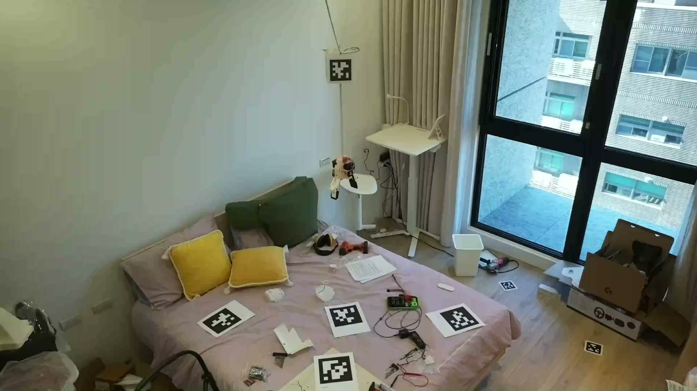
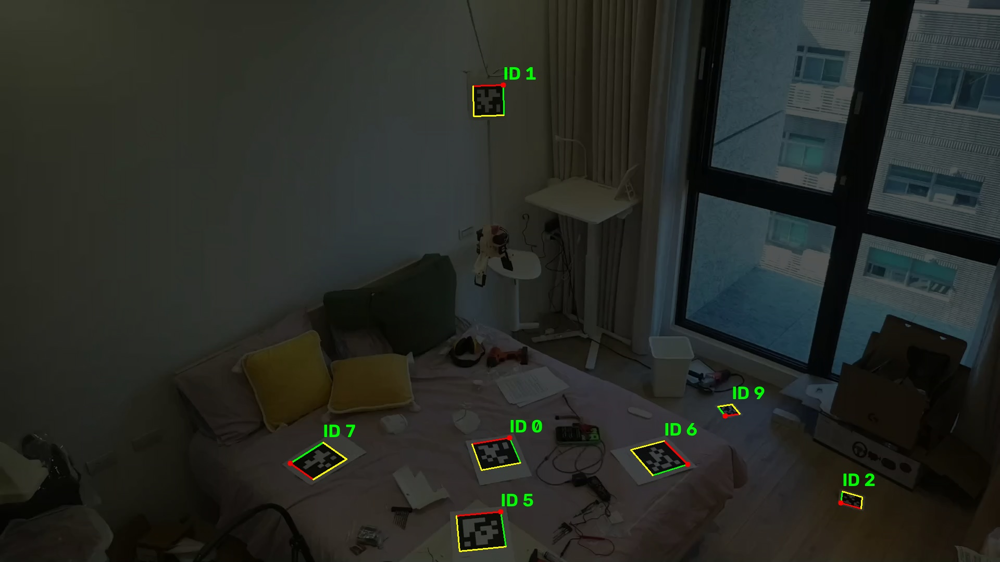
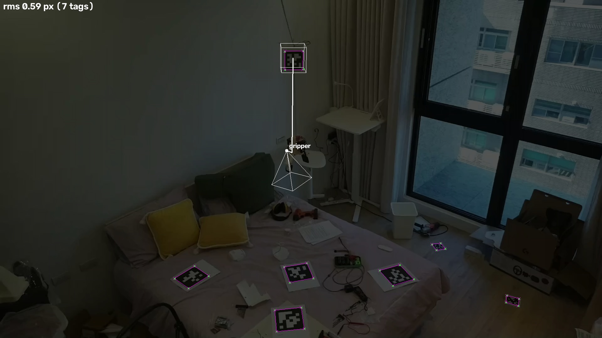
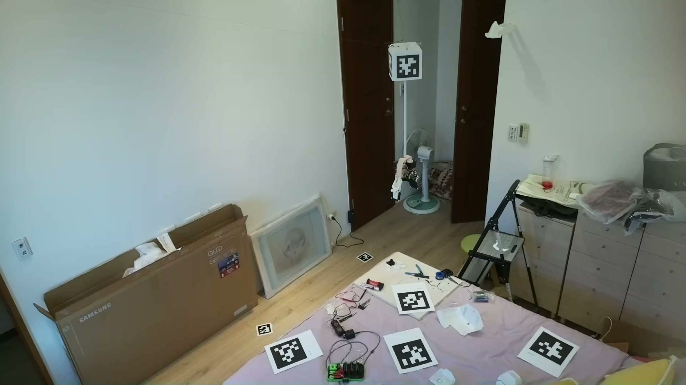
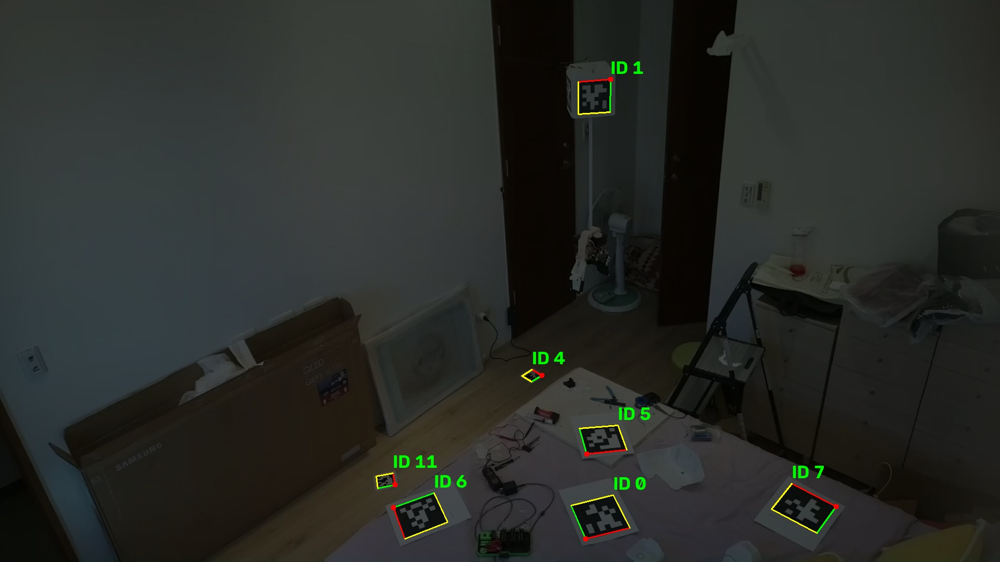
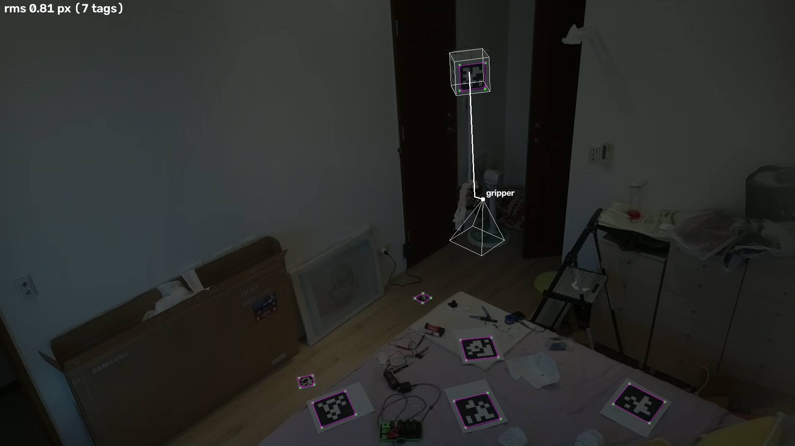
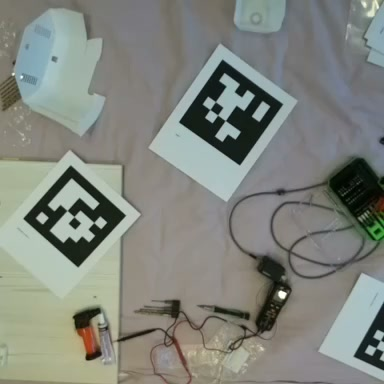
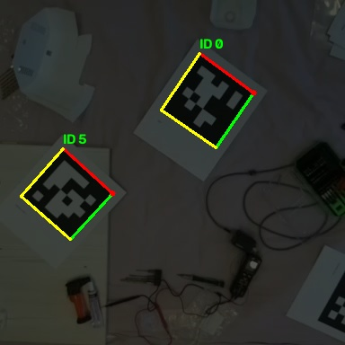
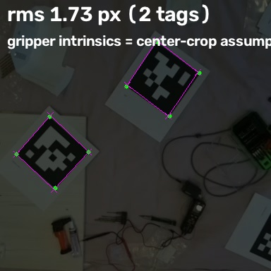

# Camera calibration

How the extrinsic calibration in this repo works, how to run it, and (at the
end) notes on where camera intrinsics are stored in the upstream
[cranebot3-firmware](https://github.com/nhnifong/cranebot3-firmware) repo.

## Local extrinsic calibration approach (this repo)

`calibrate_extrinsics.py` solves camera extrinsics and tag poses jointly by
minimizing AprilTag corner reprojection error with
`scipy.optimize.least_squares` (trf, soft_l1 loss, residuals scaled to ~pixels):

- **World frame** = tag 0 frame: its origin (lower-left corner) is fixed at
  (0,0,0), lying in the z=0 plane facing +z. All tag side lengths come from
  `config.json` (`apriltags.side_length_mm`).
- **Anchor cameras**: 6-DOF extrinsics, initialized at (2,2,2) and (-2,-2,2)
  looking at the origin, using the firmware `camera_cal` intrinsics (see the
  firmware notes below). Detected corners are undistorted once and the
  optimizer works in normalized pinhole coordinates; rendering reprojects
  with distortion.
- **Tag-1 cube**: one 6-DOF pose for the cube center; the four face tags
  (centered, tops toward +z) are derived from `marker_objects."1".width_mm`.
  Each detection is assigned to a cube face, and with exactly two observations
  the faces are forced to be OPPOSITE sides (the anchors see opposite sides of
  the hanging cube). This constraint is what made the cube converge (12.6 px
  -> 0.6 px RMS).
- **Gripper camera**: solved with the center-crop intrinsics hack (next
  section) and a rigid MOUNT CONSTRAINT to the tag-1 cube: fixed offset loaded
  from `config.json` (`apriltags.marker_objects."1".gripper_camera_offset_mm`
  = (41, 0, 530) mm in the cube frame whose +z points down in the world), orientation = solved yaw
  about the cube z-axis CENTERED AT THE CUBE CENTER (the whole mount offset
  rotates with it) followed by a fixed 9 deg pitch about the camera x-axis
  (`gripper_camera_x_tilt_rad` = 0.1571; the data clearly prefers +9 deg over
  -9 deg: 0.81 px vs 1.60 px overall RMS). The solve optimizes that single
  yaw angle; gripper observations therefore also pull on the cube pose
  through the rigid link. Without the offset or cube detections it falls back
  to free 6-DOF initialized from tag 0.
- **Staged solve, highest co-visibility first**: stage 1 uses tags seen by
  >= 2 cameras (0, 5, 6, 7 + cube); stage 2 adds single-camera tags
  (2, 4, 9, 11), initialized from the stage-1 camera poses.

Result on the `20260720_083736` batch: overall RMS **0.83 px** (anchor0 0.59,
anchor1 0.81, gripper 1.74, cube 1.96; solved gripper yaw 315 deg).

### Reprojection overlays

Solved tag outlines (magenta), detected corners (green), cube wireframe
(white), on frames dimmed to 33%. All three stages of each camera's frame
side by side; hover for a label, click any thumbnail for full size:

<table>
  <tr>
    <th>camera</th><th>captured</th><th>2D tag detection</th><th>solved 3D reprojections</th>
  </tr>
  <tr>
    <td>anchor0</td>
    <td><a href="captures/20260720_083736_anchor0.jpg"></a></td>
    <td><a href="annotated/20260720_083736_anchor0.jpg"></a></td>
    <td><a href="reprojections/20260720_083736_anchor0.jpg"></a></td>
  </tr>
  <tr>
    <td>anchor1</td>
    <td><a href="captures/20260720_083736_anchor1.jpg"></a></td>
    <td><a href="annotated/20260720_083736_anchor1.jpg"></a></td>
    <td><a href="reprojections/20260720_083736_anchor1.jpg"></a></td>
  </tr>
  <tr>
    <td>gripper</td>
    <td><a href="captures/20260720_083736_gripper.jpg"></a></td>
    <td><a href="annotated/20260720_083736_gripper.jpg"></a></td>
    <td><a href="reprojections/20260720_083736_gripper.jpg"></a></td>
  </tr>
</table>

## HACK / latent bug: gripper 384x384 intrinsics via center-crop assumption

`calibrate_extrinsics.py` uses gripper intrinsics derived from the repo's
684x384 `camera_cal_wide` by ASSUMING the 384x384 frames are a center crop of
the same sensor mode: fx/fy kept unchanged (439.318 / 461.562), cx shifted by
the horizontal crop offset ((684-384)/2 = 150) giving cx = cy = 192, and the
wide-camera distortion coefficients reused as-is (the OpenCV model anchors
them at the principal point, so they carry over under a crop).

This is unverified. If the 384x384 stream is actually produced by downscaling
or a different sensor mode (binning, ISP scaling), these intrinsics are wrong
- focal lengths would scale by ~0.561 and cy would be ~108 instead of 192.
Proper fix: chessboard-calibrate the actual 384x384 stream (or confirm the
crop path in the firmware source). Until then, treat gripper pose estimates
that depend on these intrinsics with suspicion; systematic reprojection bias
across multiple known tags is the tell.

## Scripts and run instructions

```bash
# 1. detect tags in captures/, write detections/<prefix>_detections.json
#    plus annotated/ images (also shows a paging UI; any key = next, q = quit)
.venv/bin/python detect_apriltags.py

# 2. solve extrinsics + tag poses, write
#    detections/<prefix>_calibration.json and reprojections/ images
.venv/bin/python calibrate_extrinsics.py            # add --no-ui to skip the popup
```

Dependencies (in `.venv`): `opencv-contrib-python numpy scipy` (+ `websockets`
for the capture tooling). Inputs: `captures/<prefix>_*.jpg` from
`capture_frames.py`, `config.json` for tag/cube sizes.

## Notes: camera calibration storage in cranebot3-firmware

Notes from inspecting https://github.com/nhnifong/cranebot3-firmware on where the
camera calibration data lives and how it gets written.

### Storage location

- Calibration is stored in `src/nf_robot/common/configuration.json`, the JSON
  dump of the `StringmanPilotConfig` protobuf (schema:
  `src/nf_robot/protos/robot-config.proto`, message `CameraCalibration`).
- Read/written by `load_config()` / `save_config()` in
  `src/nf_robot/common/config_loader.py`
  (`DEFAULT_CONFIG_PATH = Path(__file__).parent / 'configuration.json'`).
- The file is auto-created with built-in defaults on first run if missing.

### Stored entries

Two `CameraCalibration` entries, each with `resolution`, `intrinsic_matrix`
(flattened 3x3), and `distortion_coeff` (5 values):

- `camera_cal` — anchor cameras, 1920x1080.
  - intrinsic `[[1424, 0, 960], [0, 1424, 540], [0, 0, 1]]`
  - distortion `[0.0115842, 0.18723804, -0.00126164, 0.00058383, -0.38807272]`
  - Per code comments: NOT chessboard-derived. For Pi Camera Module 3 at fixed
    lens position 0.1, anchored against a known room height via solvePnP
    (chessboard results were too far off center).
- `camera_cal_wide` — gripper wide camera, 684x384 full-FOV, chessboard-calibrated.
  - intrinsic `[[439.318, 0, 342], [0, 461.562, 192], [0, 0, 1]]`
  - distortion `[-0.0262286, -0.0123097, -0.0003320, 0.0015433, 0.1075932]`
  - `load_config()` ALWAYS overrides the saved `camera_cal_wide` with the
    built-in default, because older configs held stale 384x384 center-crop
    intrinsics.

### How calibration gets written

- `src/nf_robot/host/calibration.py` -> `CalibrationInteractive.save()`:
  chessboard calibration (board 14x9 squares, 0.075 m/square by default), then
  writes `intrinsic_matrix`, `distortion_coeff`, and `resolution` into the
  config's `camera_cal` field (override with the `cal_field` parameter) and
  saves the JSON.
- Calibration capture images go to `images/cal/` (on-device Pi) and
  `images/cal2/` (stream capture); `calibrate_from_files()` reads from
  `images/cap/`.

### Relevance to local captures (stringman_experiments)

- Anchor captures here are 1920x1080 -> `camera_cal` intrinsics apply directly.
- Gripper captures here are 384x384, but `camera_cal_wide` is for 684x384 ->
  neither firmware cal matches the gripper frames as captured; would need a
  separate calibration (or resolution scaling of the intrinsics) for pose
  estimation from gripper frames.
